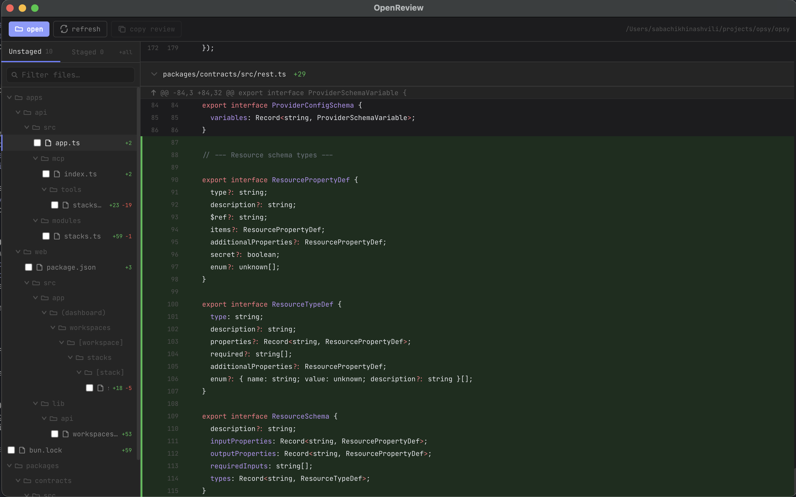

# OpenReview

A native git diff viewer with AI-powered code review via MCP. Open any repository, browse staged and unstaged changes, and let Claude (or any MCP-compatible AI) leave inline comments directly in the UI.



---

## Features

- **Git diff viewer** — staged and unstaged changes side by side, syntax highlighted, virtualised for large diffs
- **Inline comments** — click any diff line to annotate it; comments survive refreshes until the line disappears
- **File tree sidebar** — collapse/expand files, see addition/deletion counts at a glance
- **Copy review** — export all comments as plain text (file path + line + text) for pasting into PRs or tickets
- **MCP server** — full Model Context Protocol server running locally at `http://127.0.0.1:27182/mcp`; connect Claude Desktop, Cursor, or any MCP client and let the AI read the diff and post comments without leaving your editor

---

## Getting started

```bash
npm install
npm run dev
```

Click **open** in the toolbar to pick a git repository. The MCP server starts automatically alongside the app.

---

## MCP setup

The app exposes an MCP server on `http://127.0.0.1:27182/mcp` (Streamable HTTP transport). Click **mcp url** in the toolbar to copy the URL to your clipboard.

### Claude Desktop

Add to `~/Library/Application Support/Claude/claude_desktop_config.json`:

```json
{
  "mcpServers": {
    "openreview": {
      "url": "http://127.0.0.1:27182/mcp"
    }
  }
}
```

### Cursor

Add to `.cursor/mcp.json` in your project (or globally in `~/.cursor/mcp.json`):

```json
{
  "mcpServers": {
    "openreview": {
      "url": "http://127.0.0.1:27182/mcp"
    }
  }
}
```

---

## MCP capabilities

### Tools

| Tool | Description |
|---|---|
| `get_comments` | Returns all review comments. Optional `filePath` filter. |
| `add_comment` | Adds an inline comment to a diff line by `lineRef`. |
| `update_comment` | Edits the text of an existing comment by `id`. |
| `delete_comment` | Removes a comment by `id`. |

### Resources

| URI | Description |
|---|---|
| `comments://all` | Live snapshot of all current comments (subscribable). |

---

## Tech stack

Electron · React · Zustand · Tailwind CSS · Shiki · `@modelcontextprotocol/sdk`
